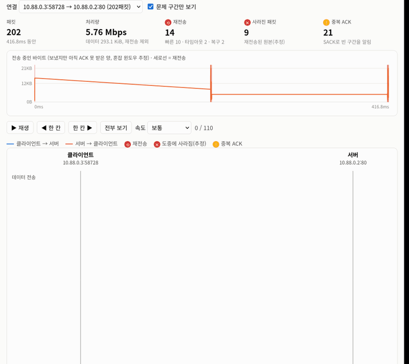
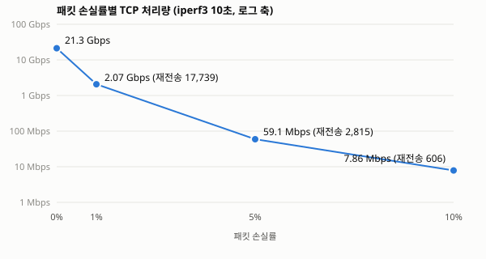

# minibox

Go로 만든 미니 컨테이너 런타임과, 그 위를 오가는 TCP 패킷을 재생하는 **패킷 여행기**.

컨테이너(namespace, cgroup, overlayfs, veth)를 직접 만들고, 그 네트워크에 패킷 손실을 주입해 TCP가 어떻게 버티는지를 패킷 단위로 보여 준다.

**▶ [패킷 여행기 바로 체험하기](https://wnsrud2002.github.io/minibox/)** (설치 없이, 샘플 캡처 포함)

**📖 [학습 가이드: minibox로 배우는 컨테이너와 TCP](docs/LEARN.md)**: 네임스페이스, cgroup, overlayfs, veth, TCP 재전송과 SACK를 배경지식부터 설명한다



## 무엇을 보여 주나

| | 결과 |
|---|---|
| 격리 | 컨테이너 안에서 `echo $$` = 1, 자기 프로세스만 보이는 `ps`, 원본 이미지를 건드리지 않는 overlayfs |
| 자원 제한 | fork bomb은 `pids.max=20`에서 멈춤, 64MiB 초과 시 OOM kill, 0.5코어 제한 실측 **0.50코어** |
| 네트워크 | 컨테이너 A↔B 0.18ms, 컨테이너 간 iperf3 **21.3 Gbps**, NAT로 외부 인터넷 |
| 장애 주입 | 손실 1%에서 처리량 1/10, 10%에서 1/2,700. SACK 빠른 재전송은 0.05ms, 타임아웃은 206ms |



**손실 10% 캡처에서 알게 된 것.** 재전송 14번 중 10번은 SACK 덕분에 0.05ms 만에 끝났다. 하지만 타임아웃 두 번이 각각 206ms씩, 전체 416ms 중 412ms를 차지했다. 성능을 결정한 건 손실 자체보다 **최소 RTO(200ms) 대기**였다. 자세한 측정과 트러블슈팅은 [EXPERIMENTS.md](EXPERIMENTS.md)에 있다.

## 구조

```
┌──────────── Linux 호스트: Jetson Orin Nano (Ubuntu 24.04, arm64) ────────────┐
│  minibox (Go, 표준 라이브러리만)                                            │
│   ├─ run    : clone(NEWPID|NEWUTS|NEWNS|NEWNET|NEWIPC) → re-exec → pivot_root │
│   ├─ cgroup : /sys/fs/cgroup/minibox/<id>/{memory,cpu,pids}.max             │
│   │           CLONE_INTO_CGROUP으로 태어날 때부터 제한                       │
│   ├─ image  : alpine rootfs(lower, 읽기 전용) + 컨테이너별 upper (overlayfs) │
│   ├─ net    : mb0 브리지 ─ veth ─ 컨테이너 eth0, iptables MASQUERADE         │
│   ├─ chaos  : iptables statistic(확률 드롭) + tc tbf(대역폭)                  │
│   └─ serve  : 대시보드(SSE) + 패킷 여행기                                    │
│  tcpdump -i mb0 -w cap.pcap                                                 │
└──────────────────────────────────────────┬──────────────────────────────────┘
                                           ▼
                 브라우저 (빌드 도구 없는 순수 JS)
                  ├─ 대시보드: cgroup 사용량 그래프, 네임스페이스 분리 표
                  └─ 패킷 여행기: pcap 직접 파싱 → 시퀀스 애니메이션, 재전송·SACK 분석
```

## 실행

리눅스(cgroup v2)와 root 권한이 필요하다. Jetson Orin Nano(arm64)에서 개발했다.

```bash
./scripts/fetch-alpine.sh            # alpine minirootfs를 images/alpine에 받기
go build -o minibox ./cmd/minibox
sudo ./minibox check                 # 호스트 조건 점검
```

| 명령 | 하는 일 |
|---|---|
| `sudo ./minibox run [--mem 64m] [--cpu 0.5] [--pids 64] alpine /bin/sh` | 격리된 컨테이너 실행. 끝나면 사용량 요약 출력 |
| `sudo ./minibox ps` | 실행 중인 컨테이너(ID, PID, IP, 명령) |
| `sudo ./minibox stop <ID\|IP>` | 컨테이너 종료 |
| `sudo ./minibox serve` | http://localhost:7070 대시보드, `/travel/travel.html` 패킷 여행기 |
| `sudo ./minibox net chaos --loss 10% [--rate 1mbit]` | 컨테이너 네트워크에 손실·대역폭 제한 주입 |
| `sudo ./minibox net clear` | 장애 주입 해제 |
| `sudo ./minibox gc [--net]` | 비정상 종료 후 남은 cgroup·임시 디렉터리·IP 정리 (`--net`: 브리지와 iptables 체인까지) |

### 손실 실험 재현

```bash
sudo ./minibox net chaos --loss 10%
sudo tcpdump -i mb0 -Z root -w captures/loss10.pcap tcp port 80 &
sudo ./minibox run alpine sh -c "{ printf 'HTTP/1.0 200 OK\r\nContent-Length: 300000\r\n\r\n'; head -c 300000 /dev/urandom; } | nc -l -p 80" &
sudo ./minibox run alpine sh -c "wget -O- http://10.88.0.2/ | wc -c"
# http://localhost:7070/travel/travel.html?src=/captures/loss10.pcap
```

## 안전장치

SSH로 접속한 원격 장비의 네트워크를 건드리는 프로젝트라서 범위를 좁게 잡았다.

- `mb0` 브리지와 `10.88.0.0/24`만 만든다. 다른 인터페이스와 기본 라우트는 건드리지 않는다.
- iptables 규칙은 전용 체인(`MINIBOX`, `MINIBOX-CHAOS`)에만 넣는다. `gc --net` 한 번으로 모두 지워진다.
- 컨테이너의 `/dev`에는 null, zero, random 같은 기본 장치 6개만 둔다.

## 테스트

```bash
go test ./...        # cgroup 크기 파싱
node --test web/     # pcap 파서: 엔디언, 흐름 묶기, 상대 seq, 손실 → SACK → 빠른 재전송 → 타임아웃
```
